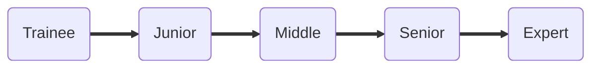

# Tech Skills Matrix
Skills matrix to evaluate QA engineers

## How to use?

- Open in Github pages: https://infopulse.github.io/Tech-Skills-Matrix
- Review required skills for each level and category
- Evaluate yourself and your team members

We encourage you to use this matrix in your companies to align skills and knowledge of QA engineers worldwide.

It is expected:

1. every QA Engineer who claims specific seniority level must have 7+ basic skills not less then this level
2. every next seniority level includes skills and knowledge of all previous levels
3. tech skills are generalized to be applicable to wide range of engineers

## How to contribute?

Leave your comments and suggestions in [Issues](https://github.com/infopulse-qa/skills-matrix/issues)
