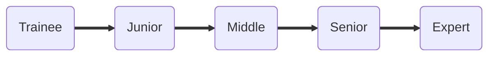

# Tech Skills Matrix
Skills matrix to evaluate **tech** skills of QA engineers.  
Soft skills are important as well, but they are not included in this matrix.

## How to use?
You are welcome to use this matrix as reference in your 
There are 2 options to use this matrix:
1. Open in GitHub pages (recommended): https://infopulse.github.io/Tech-Skills-Matrix-QA
2. Check out every skill category in markdown files:
   - [Test Planning](matrix/01.%20planning.md) - Estimations, tasks prioritization, test documentation, test management, risk management
   - [Test Design](matrix/02.%20design.md) - Test case creation, test analysis, check list creating
   - [Test Reporting](matrix/03.%20reporting.md) - Test metrics
   - [SDLC](matrix/04.%20sdlc.md) - Methodologies (Agile family, traditional), Build/Deploy Environments
   - [Troubleshooting](matrix/05.%20troubleshooting.md) - Bug Reporting, defects localization, issue investigation
   - [Requirements Management](matrix/06.%20requirements.md) - Requirements analysis, testing of requirements
   - [Working with the Data](matrix/07.%20data.md) - Data structures, Data testing, Excel, Data analysis
   - [Tech skills](matrix/08.%20tech.md) - General tech knowledge in: Webservices, Web technologies, client-server apps, OS, UNIX, SQL, APIs

- Review required skills for each level and category
- Give yourself honest feedback if you know well enough each skill (In future releases we will provide a self-assessment tool)

We encourage you to use this matrix in your companies to align the skills and knowledge of QA engineers worldwide.

## Rules
As a company we expect that:
1. every QA Engineer who claims a specific seniority level must have at least 7 basic skill categories not less than this level
2. every next seniority level includes skills and knowledge of all previous levels
3. tech skills are generalized to apply to a wide range of engineers
4. the matrix is used both for internal QA engineers and for [hiring purposes](https://www.infopulse.com/join-us?specialization=9)

## Roadmap
_⚠️ Currently under development_  
It is good to measure the skills using the matrix, but it is even better to have a guide on how to improve the skills 
and gain new knowledge.

## How to contribute?
You are welcome to:
- leave your comments and suggestions in [Issues](https://github.com/infopulse/Tech-Skills-Matrix-QA/issues)
- create pull-requests with your changes
Or create a pull-request!
