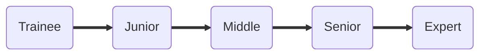

# skills-matrix
Skills matrix to evaluate QA engineers

## How to use?

- Open in Github pages: https://infopulse-qa.github.io/skills-matrix/
- Review required skills for each level and category
- Evaluate yourself and your team members

We encourage you to use this matrix in your companies to align skills and knowledge of QA engineers worldwide.

It is expected:
1. every QA Engineer who claims specific seniority level must have 7+ basic skills not less then this level
2. every next seniority level includes skills and knowledge of all previous levels
3. tech skills are generalized to be applicable to wide range of engineers

| Categories                | Category description                                                                             |   Trainee |  Junior |   Middle |  Senior |   Expert |
|:--------------------------|:-------------------------------------------------------------------------------------------------|----------:|--------:|---------:|--------:|---------:|
| TEST PLANNING             | Estimations, tasks prioritization, test documentation, test management, risk management          |       ✅ |      ✅ |      ✅ |      ✅ |      ❌ |
| TEST DESIGN               | Test case creation, test analysis, check list creating                                           |       ✅ |      ✅ |      ✅ |      ✅ |      ✅ |
| TEST REPORTING            | Test metrics                                                                                     |       ✅ |      ✅ |      ✅ |      ✅ |      ❌ |
| SDLC                      | Methodologies (Agile family, traditional), Build/Deploy -- Environments                          |       ✅ |      ✅ |      ✅ |      ✅ |      ❌ |
| ISSUE INVESTIGATION       | Bug Reporting, defects localization, issue investigation                                         |       ✅ |      ✅ |      ✅ |      ✅ |      ✅ |
| WORKING WITH REQUIREMENTS | Requirements analysis, testing of requirements                                                   |       ✅ |      ✅ |      ✅ |      ✅ |      ✅ |
| WOKING WITH DATA          | Data structures, Data testing, Excel, Data analysis                                              |       ✅ |      ✅ |      ❌ |      ❌ |      ❌ |
| TECH SKILLS               | Webservices, Web technologies, client-server apps, OS, UNIX, SQL, APIs, tech knowledge (general) |       ✅ |      ✅ |      ✅ |      ❌ |      ❌ |

## How to contribute?

Leave your comments and suggestions in [Issues](https://github.com/infopulse-qa/skills-matrix/issues)
